# Docker Workshop - Custom Java Framework (No Spring)

Minimal web framework in Java for the Docker + AWS workshop.
This project follows the lab flow and keeps the same style of classes (`RestServiceApplication`, `HelloRestController`) but uses a custom framework (`SimpleHttpServer`) instead of Spring.

---

## Author

Juan Sebastian Ortega Muñoz

---

## Table of contents

1. [Project objective](#project-objective)
2. [Workshop requirements covered](#workshop-requirements-covered)
3. [Architecture](#architecture)
4. [Class design](#class-design)
5. [Concurrency and graceful shutdown](#concurrency-and-graceful-shutdown)
6. [Project structure](#project-structure)
7. [Requirements](#requirements)
8. [Build and run (local)](#build-and-run-local)
9. [Automated tests](#automated-tests)
10. [Docker image and containers](#docker-image-and-containers)
11. [Docker Compose (web + mongo)](#docker-compose-web--mongo)
12. [Docker Hub publication](#docker-hub-publication)
13. [AWS EC2 deployment](#aws-ec2-deployment)
14. [Evidence checklist for rubric](#evidence-checklist-for-rubric)
15. [Video deliverable](#video-deliverable)

---

## Project objective

Build and deploy a Java web application with these rules:

- Use a custom framework (no Spring).
- Support concurrent HTTP requests.
- Stop the server in a graceful way.
- Package and run with Docker.
- Deploy the image on AWS EC2.

---

## Workshop requirements

- Maven Java project with Java 17.
- Simple HTTP endpoints (`/hello`, `/greeting`).
- Dependencies copied to `target/dependency` during `package`.
- Dockerfile for image creation.
- `docker-compose.yml` with `web` + `mongo` services.
- Ready flow for Docker Hub push and EC2 run.

---

## Architecture

```text
Client (Browser / curl)
		|
		v
RestServiceApplication (main)
		|
		v
SimpleHttpServer
  - route registry with registerGET(path, handler)
  - Java HttpServer under the hood
  - fixed thread pool executor
		|
		v
HelloRestController.greeting(query)
  - parse query params
  - return plain text response
```

---

## Class design

### `src/main/java/co/edu/escuelaing/dockerworkshop/RestServiceApplication.java`

- Entry point (`main`).
- Reads `PORT` from environment (default `5000`).
- Registers routes:
  - `/greeting`
  - `/hello`
- Adds a JVM shutdown hook to stop server safely.

### `src/main/java/co/edu/escuelaing/dockerworkshop/SimpleHttpServer.java`

- Wrapper over `com.sun.net.httpserver.HttpServer`.
- Uses `ExecutorService` with fixed thread pool.
- Exposes `registerGET(...)`, `start()`, and `shutdown()`.
- Handles method validation (`405`) and internal errors (`500`).

### `src/main/java/co/edu/escuelaing/dockerworkshop/HelloRestController.java`

- Handles greeting logic.
- Parses query string (`name=<value>`).
- Returns: `Hello, <name>!`.

---

## Concurrency and graceful shutdown

### Why it is concurrent

The server is concurrent because it uses a thread pool:

- `Executors.newFixedThreadPool(...)` creates many worker threads.
- Each incoming request is executed by one available worker.
- Multiple requests are processed at the same time.

### Why shutdown is graceful

`shutdown()` is called from a JVM shutdown hook:

1. Stop accepting new requests (`server.stop(5)`).
2. Shutdown executor (`executor.shutdown()`).
3. Wait for active tasks (`awaitTermination`).
4. Force stop only if needed (`shutdownNow()`).

This avoids killing the process abruptly.

---

## Project structure

```text
docker-containerized-web-service/
|-- .gitignore
|-- Dockerfile
|-- docker-compose.yml
|-- pom.xml
|-- README.md
`-- src/
	|-- main/
	|   `-- java/co/edu/escuelaing/dockerworkshop/
	|       |-- RestServiceApplication.java
	|       |-- SimpleHttpServer.java
	|       `-- HelloRestController.java
	`-- test/
		`-- java/co/edu/escuelaing/dockerworkshop/
			|-- HelloRestControllerTest.java
			`-- SimpleHttpServerIntegrationTest.java
```

---

## Requirements

- Java 17+
- Maven 3.9+
- Docker Desktop
- Git

---

## Build and run (local)

### 1) Compile and package

```bash
mvn clean package
```

### 2) Run with Java classpath (workshop style)

Linux/macOS:

```bash
java -cp "target/classes:target/dependency/*" co.edu.escuelaing.dockerworkshop.RestServiceApplication
```

Windows PowerShell:

```powershell
java -cp "target/classes;target/dependency/*" co.edu.escuelaing.dockerworkshop.RestServiceApplication
```

### 3) Try endpoints

- `http://localhost:5000/hello`
- `http://localhost:5000/greeting`
- `http://localhost:5000/greeting?name=Juan`

Expected examples:

- `Hello, World!`
- `Hello, Juan!`

---

## Automated tests

This project includes JUnit 5 automated tests:

- `HelloRestControllerTest`
  - default greeting
  - query param parsing
  - URL decoding
- `SimpleHttpServerIntegrationTest`
  - endpoint response `200`
  - method validation `405`

Run tests:

```bash
mvn test
```

---

## Docker image and containers

### 1) Build image

```bash
docker build --tag dockerworkshop .
```

### 2) Check image

```bash
docker images
```

### 3) Run three containers

```bash
docker run -d -p 34000:6000 --name firstdockercontainer dockerworkshop
docker run -d -p 34001:6000 --name firstdockercontainer2 dockerworkshop
docker run -d -p 34002:6000 --name firstdockercontainer3 dockerworkshop
```

### 4) Validate

```bash
docker ps
```

Open in browser:

- `http://localhost:34000/hello`
- `http://localhost:34001/hello`
- `http://localhost:34002/hello`

---

## Docker Compose (web + mongo)

Start services:

```bash
docker-compose up -d
```

Validate:

```bash
docker ps
```

Expected:

- `web` service at `http://localhost:8087/hello`
- `db` service (`mongo:3.6.1`) at port `27017`

---

## Docker Hub publication

Tag image:

```bash
docker tag dockerworkshop <DOCKERHUB_USER>/<REPOSITORY_NAME>:latest
```

Login:

```bash
docker login
```

Push:

```bash
docker push <DOCKERHUB_USER>/<REPOSITORY_NAME>:latest
```

---

## AWS EC2 deployment

### 1) EC2 setup

- Create EC2 instance (Amazon Linux, for example `t2.micro`).
- Open inbound ports in Security Group:
  - `22` (SSH)
  - `42000` (application demo)

### 2) Install Docker in EC2

```bash
sudo yum update -y
sudo yum install docker -y
sudo service docker start
sudo usermod -a -G docker ec2-user
```

Reconnect SSH to apply group permissions.

### 3) Run container from Docker Hub

```bash
docker run -d -p 42000:6000 --name firstdockerimageaws <DOCKERHUB_USER>/<REPOSITORY_NAME>:latest
```

### 4) Validate in browser

- `http://<EC2_PUBLIC_DNS>:42000/hello`
- `http://<EC2_PUBLIC_DNS>:42000/greeting?name=AWS`

---

## Evidence

### Local tests and packaging

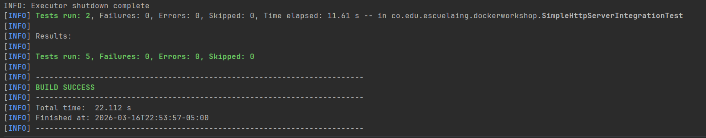
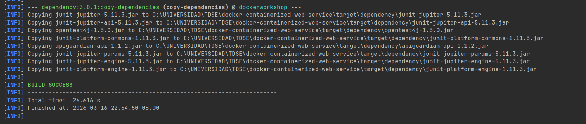

### Docker local deployment

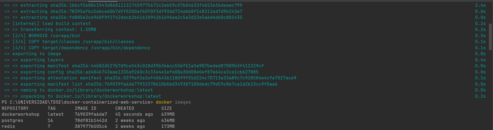
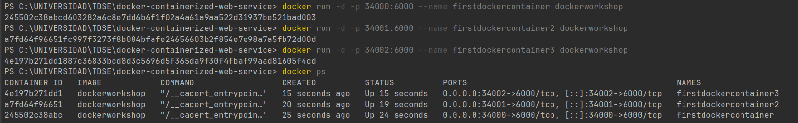
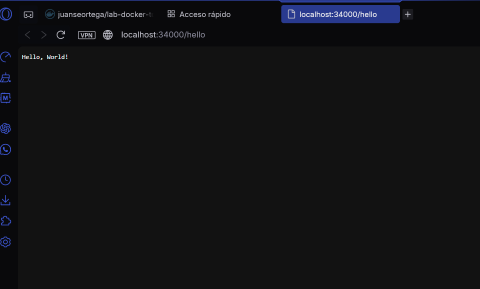

### Docker Compose deployment

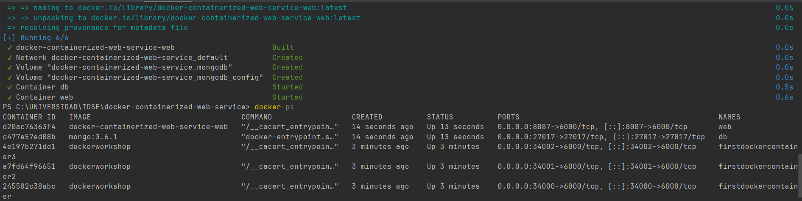

### Docker Hub publication

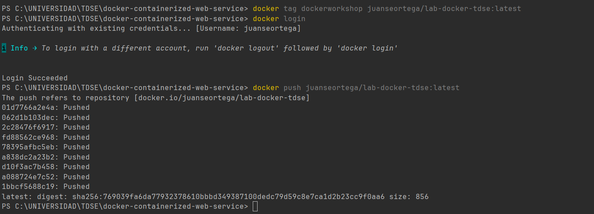
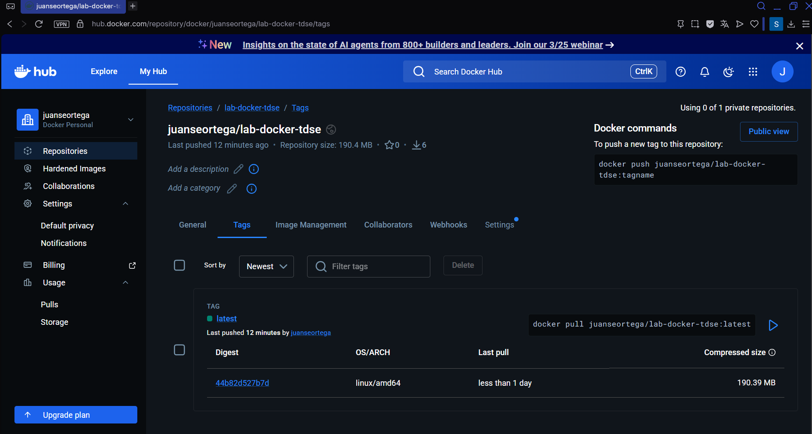

### AWS deployment

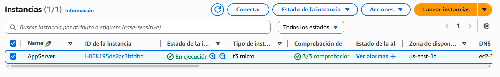
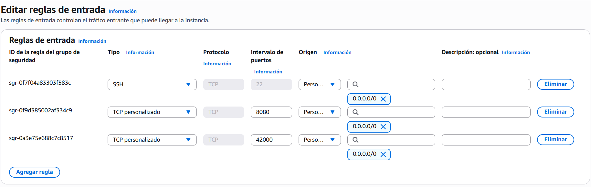
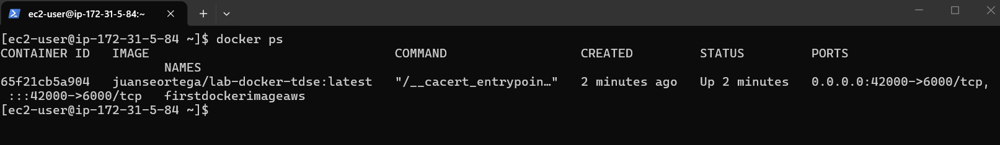
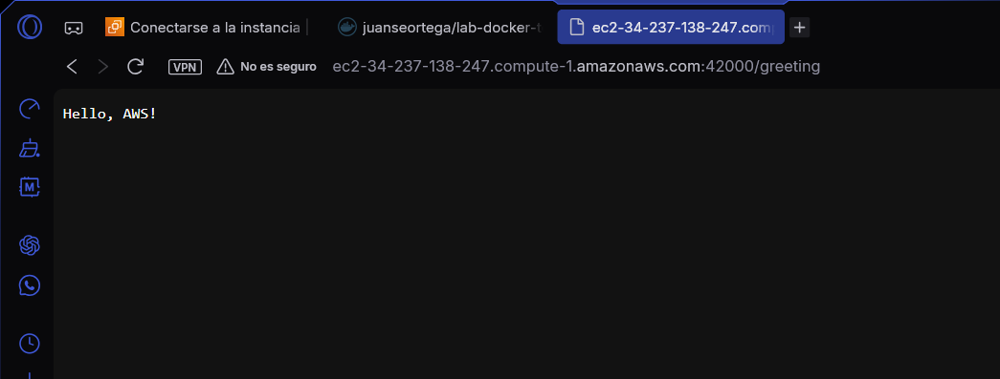

---

## Video

Watch the demo video here:  
[Demo video (Docker + AWS EC2)](https://youtu.be/zBU0WhrH0wI)

